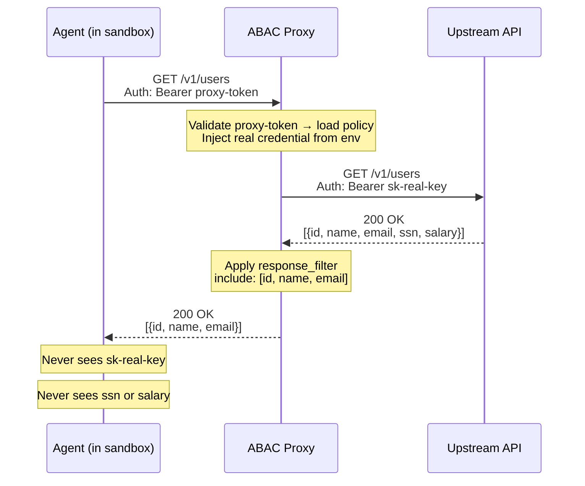

# ABAC Proxy

**Agent-Based Access Control for REST APIs**

ABAC is a reverse proxy that sits between AI agent sandboxes and upstream APIs. It enforces fine-grained access policies, injects credentials agents never see, and filters response data — all without modifying the agent or the upstream API.

## The Problem

When AI agents (Claude Code, custom tool-use agents, etc.) run inside sandboxes, they need to call external APIs. This creates two problems:

1. **Credential exposure.** Passing API keys into an agent sandbox means the LLM can see, log, or leak those credentials. Even with well-behaved models, the attack surface grows with every tool and every token.

2. **No access control.** Most REST APIs have coarse or nonexistent RBAC. An agent with a valid API key can typically hit any endpoint and read any field — far more access than it needs for its task.

ABAC solves both by acting as a credential-injecting, policy-enforcing gateway that lives _outside_ the sandbox.

## How It Works



The agent authenticates to the proxy with a non-sensitive proxy token. The proxy looks up what that token is allowed to do, forwards the request with real API credentials injected, and strips fields from the response before returning it to the agent. Two things happen that the agent never observes:

1. **Token swap** — the proxy token (`proxy-token`) is replaced with the real API key (`sk-real-key`) from an environment variable. The real credential never enters the sandbox.
2. **Response filtering** — sensitive fields (`ssn`, `salary`) are stripped before the response reaches the agent. The agent only sees the fields the policy allows.

## Key Features

- **Credential isolation** — Real API keys stay outside the sandbox. Agents only hold a proxy token with no upstream value.
- **Route-level access control** — Allow or deny specific HTTP method + path combinations per upstream API.
- **Response filtering** — Strip sensitive fields from API responses before they reach the agent (include or exclude field lists, nested path support).
- **Host allowlisting** — Proxy only routes to explicitly configured upstream hosts. Wildcard subdomain support.
- **Multiple upstream APIs** — A single proxy token can grant scoped access to multiple backends, each with its own credentials and rules.
- **Deny by default** — Unmatched routes are denied unless explicitly configured otherwise.

## Getting Started

### Docker

Pull the pre-built image from GHCR:

```bash
docker pull ghcr.io/ajmcquilkin/abac-proxy:latest
```

Run from the root of the repo using the included examples:

```bash
docker run -p 8080:8080 \
  -v ./examples:/policies \
  --env-file .env \
  ghcr.io/ajmcquilkin/abac-proxy:latest \
  --policy-group-dir /policies
```

Pin to a specific commit SHA for reproducibility:

```bash
docker run -p 8080:8080 \
  -v ./examples:/policies \
  ghcr.io/ajmcquilkin/abac-proxy:<commit-sha> \
  --policy-group-dir /policies
```

### From Source

ABAC uses [Hermit](https://cashapp.github.io/hermit/) for toolchain management (best supported on macOS). After cloning the repo, activate Hermit to get the correct versions of Bazel, Go, and other tools:

```bash
. ./bin/activate-hermit
```

The fastest way to run the proxy locally is with the included `run.sh` script, which builds and starts the proxy in file mode using the `examples/` directory:

```bash
./run.sh
```

`run.sh` also supports `--db` for database mode and `--migrate` / `--seed` for DB setup. See the script header for details.

You can also build and run the binary directly:

```bash
bazel build //cmd/proxy:proxy

./bazel-bin/cmd/proxy/proxy \
  --policy-group ./policies/my-agents.policygroup.json --port 8080
```

### Test It

Using the example policies, the proxy token is `my-proxy-token`. Try these requests against the running proxy:

```bash
# List users (response filtered to id, name, address.city, address.geo)
curl -s -H "Authorization: Bearer my-proxy-token" \
  -H "Host: jsonplaceholder.typicode.com" \
  "http://localhost:8080/users"

# Get a single user (response filtered to id, name, address.zipcode)
curl -s -H "Authorization: Bearer my-proxy-token" \
  -H "Host: jsonplaceholder.typicode.com" \
  "http://localhost:8080/users/2"

# Browserbase session (credential injected via x-bb-api-key header)
curl -s -H "Authorization: Bearer my-proxy-token" \
  -H "Host: api.browserbase.com" \
  "http://localhost:8080/v1/sessions/<session-id>"

# Denied — no rule allows POST
curl -s -X POST -H "Authorization: Bearer my-proxy-token" \
  -H "Host: jsonplaceholder.typicode.com" \
  "http://localhost:8080/users"

# Denied — invalid token
curl -s -H "Authorization: Bearer wrong-token" \
  -H "Host: jsonplaceholder.typicode.com" \
  "http://localhost:8080/users"
```

## Configuration

### Policy Groups

Policies are defined in `.policygroup.json` files. A policy group binds a proxy token to a set of upstream API policies:

```json
{
  "version": "1.0",
  "localToken": "agent-sandbox-token",
  "policies": [
    {
      "baseUrl": "https://api.example.com",
      "localUpstreamTokenKey": "EXAMPLE_API_KEY",
      "rules": [
        {
          "route": "/v1/users",
          "method": "GET",
          "action": "allow",
          "response_filter": {
            "type": "include_fields",
            "fields": ["id", "name", "email"]
          }
        },
        {
          "route": "/v1/users/*",
          "method": "DELETE",
          "action": "deny"
        }
      ]
    }
  ]
}
```

| Field                     | Description                                             |
| ------------------------- | ------------------------------------------------------- |
| `localToken`              | The token agents use to authenticate to the proxy       |
| `baseUrl`                 | Upstream API base URL                                   |
| `localUpstreamTokenKey`   | Environment variable containing the real API credential |
| `rules[].route`           | Path pattern (`*` matches a single path segment)        |
| `rules[].method`          | HTTP method (empty = match all methods)                 |
| `rules[].action`          | `allow` or `deny`                                       |
| `rules[].response_filter` | Optional — filter response JSON fields                  |

### Upstream Authentication

By default, upstream credentials are sent as `Authorization: Bearer <token>`. For APIs that use custom headers:

```json
{
  "baseUrl": "https://api.browserbase.com",
  "localUpstreamTokenKey": "BROWSERBASE_API_KEY",
  "upstreamTokenType": "custom",
  "upstreamHeaderString": "x-bb-api-key",
  "rules": [...]
}
```

### Response Filtering

Control what data agents can see from API responses:

```json
{
  "response_filter": {
    "type": "include_fields",
    "fields": ["id", "name", "address.city"]
  }
}
```

- `include_fields` — keep only listed fields, remove everything else
- `exclude_fields` — remove listed fields, keep everything else
- Nested paths supported: `address.city`, `[].id` (for arrays)

### CLI Flags

| Flag                        | Default | Description                                              |
| --------------------------- | ------- | -------------------------------------------------------- |
| `--policy-group <path>`     | —       | Path to a `.policygroup.json` file (repeatable)          |
| `--policy-group-dir <dir>`  | —       | Load all `*.policygroup.json` files from directory       |
| `--port <num>`              | `8080`  | HTTP listen port                                         |
| `--passthrough-unspecified` | `false` | Allow requests that don't match any rule (default: deny) |

### Default Action & Rule Resolution

When a request doesn't match any rule:

1. Policy group's `defaultAction` (if set)
2. `--passthrough-unspecified` flag (if enabled)
3. **Deny** (default)

Rules are evaluated in order — **first match wins**.

## Example: Sandboxed Claude Code

Give Claude Code access to a project management API and a search API, without exposing either credential:

```json
{
  "version": "1.0",
  "localToken": "claude-sandbox-abc123",
  "policies": [
    {
      "baseUrl": "https://api.linear.app",
      "localUpstreamTokenKey": "LINEAR_API_KEY",
      "rules": [
        { "route": "/v1/issues", "method": "GET", "action": "allow" },
        { "route": "/v1/issues", "method": "POST", "action": "allow" },
        { "route": "/v1/issues/*", "method": "PATCH", "action": "allow" }
      ]
    },
    {
      "baseUrl": "https://api.brave.com",
      "localUpstreamTokenKey": "BRAVE_SEARCH_KEY",
      "rules": [
        { "route": "/res/v1/web/search", "method": "GET", "action": "allow" }
      ]
    }
  ]
}
```

The agent gets a single proxy token (`claude-sandbox-abc123`) that grants read/write to Linear issues and read-only to Brave search. No credential ever enters the sandbox.

## Security Model

- **Deny by default** — anything not explicitly allowed is blocked
- **Credential isolation** — upstream tokens loaded from environment variables at startup, never exposed to agents
- **Host allowlisting** — the proxy only forwards to hosts declared in policies
- **Response filtering** — prevent over-disclosure of sensitive fields in API responses
- **No credential storage** — proxy tokens are non-sensitive; real credentials live in environment variables

## Database Mode (In Development)

File-based configuration works well for static deployments. Database-backed policy management is currently in development and not yet supported. It will enable:

- Dynamic policy updates without proxy restarts
- Token hashing for proxy credentials
- Centralized policy management across multiple proxy instances

## Building

```bash
# Build the proxy binary
bazel build //cmd/proxy

# Build the dev binary (native OS/arch)
bazel build //cmd/proxy:proxy

# Build and push the Docker image to a local registry
bazel run //cmd/proxy:push-local

# After adding/changing files or imports
bazel run //:gazelle
```
